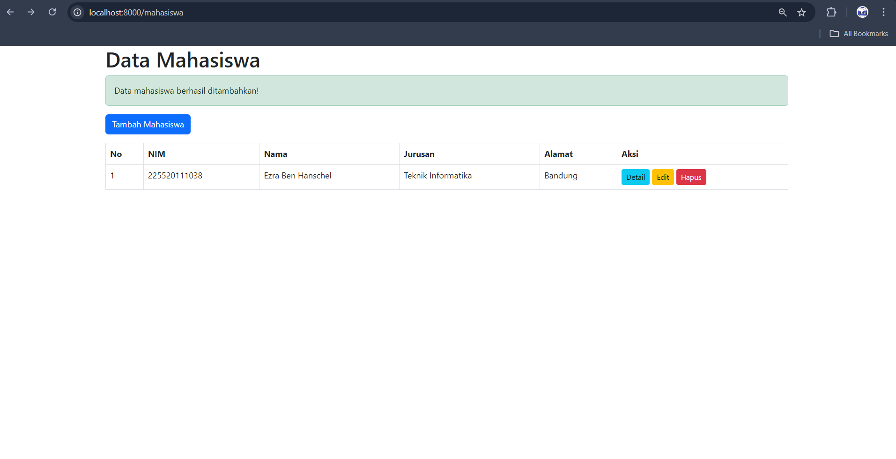
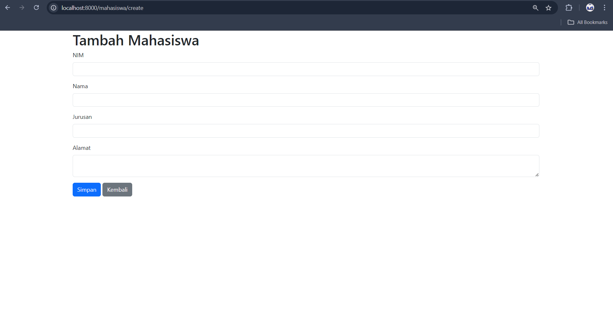
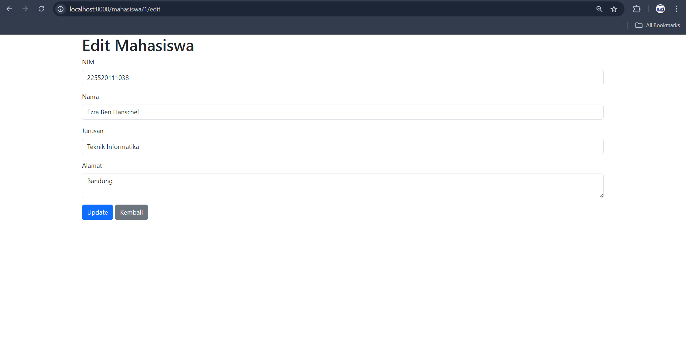
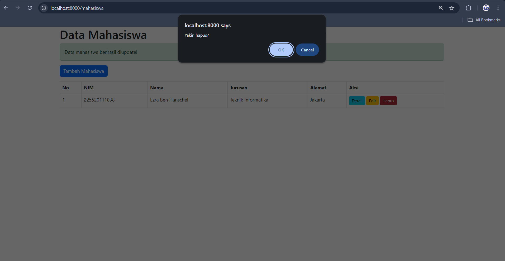
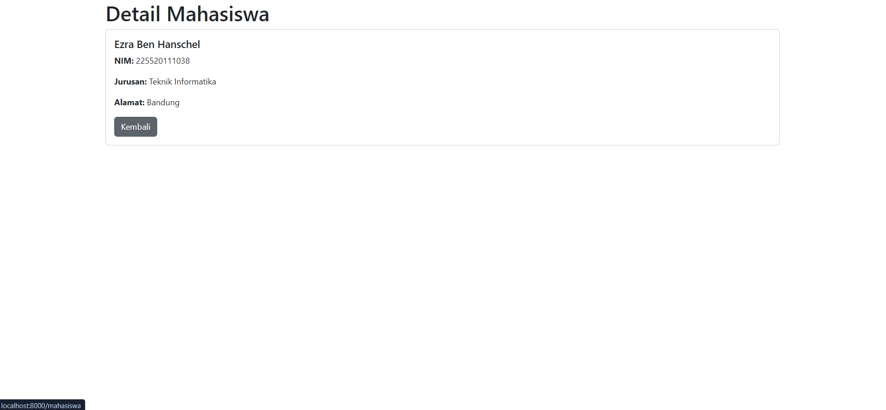

# Aplikasi CRUD Data Mahasiswa - Laravel

Ini adalah proyek tugas untuk membuat aplikasi web sederhana **CRUD (Create, Read, Update, Delete)** data mahasiswa menggunakan framework PHP, yaitu **Laravel**.

Aplikasi ini mendemonstrasikan fungsionalitas dasar dalam mengelola data, mulai dari menampilkan, menambah, mengubah, hingga menghapus data dari database.

## 📸 Tangkapan Layar (Screenshots)

Berikut adalah 4 tangkapan layar yang menampilkan fungsionalitas utama dari aplikasi ini.

| Tampilan Utama (Read) | Form Tambah (Create) |
| :----------------------------------------------------------: | :----------------------------------------------------------: |
| **Daftar semua data mahasiswa yang ada di database.** | **Form untuk menambahkan data mahasiswa baru.** |
|  |  |
| **Form Edit (Update)** | **Konfirmasi Hapus (Delete)** |
| **Form untuk mengubah data mahasiswa yang sudah ada.** | **Dialog konfirmasi sebelum menghapus data.** |
|  |  |

### Tampilan Detail

Tampilan ini menunjukkan detail lengkap dari satu data mahasiswa yang dipilih.



## 🚀 Instalasi dan Konfigurasi

Ikuti langkah-langkah berikut untuk menjalankan proyek ini di lingkungan lokal Anda.

1.  **Clone repositori ini:**
    ```bash
    git clone [https://github.com/](https://github.com/)[USERNAME-ANDA]/[NAMA-REPOSITORI-ANDA].git
    ```

2.  **Masuk ke direktori proyek:**
    ```bash
    cd [NAMA-REPOSITORI-ANDA]
    ```

3.  **Install semua dependency Composer:**
    ```bash
    composer install
    ```

4.  **Salin file `.env.example` menjadi `.env`:**
    ```bash
    cp .env.example .env
    ```

5.  **Generate application key baru:**
    ```bash
    php artisan key:generate
    ```

6.  **Konfigurasi database Anda di file `.env`:**
    ```
    DB_CONNECTION=mysql
    DB_HOST=127.0.0.1
    DB_PORT=3306
    DB_DATABASE=mahasiswa
    DB_USERNAME=root
    DB_PASSWORD=
    ```

7.  **Jalankan migrasi database untuk membuat tabel:**
    ```bash
    php artisan migrate
    ```

8.  **(Opsional) Jalankan seeder untuk mengisi data awal:**
    ```bash
    php artisan db:seed
    ```

9.  **Jalankan server development:**
    ```bash
    php artisan serve
    ```

10. **Buka browser** dan kunjungi `http://127.0.0.1:8000`.

---
